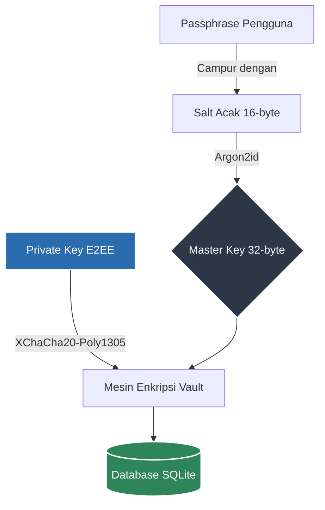
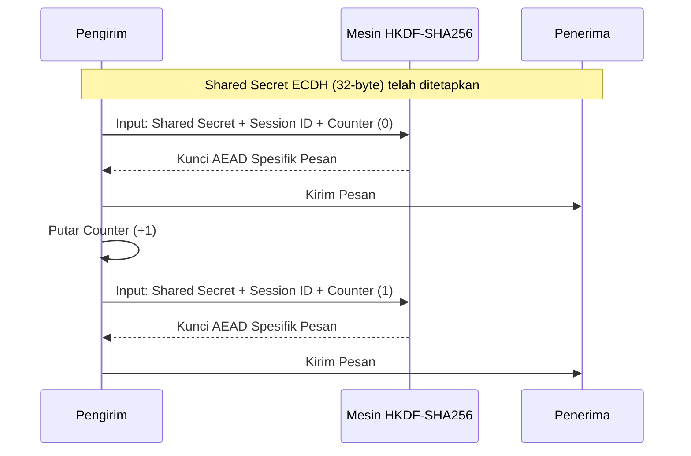
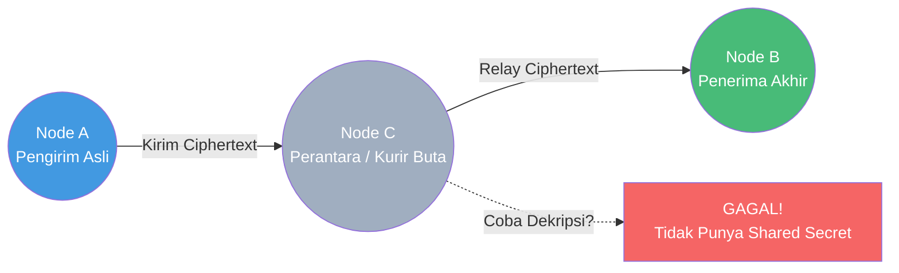

# Arsitektur Kriptografi CARAKA Desktop

Dokumen ini memaparkan rancangan, spesifikasi, dan justifikasi (dasar pemilihan) arsitektur kriptografi pada CARAKA Desktop. Sistem E2EE (*End-to-End Encryption*) pada CARAKA dirancang khusus untuk memenuhi standar keamanan tinggi pada *offline mesh network* dan *Tor hidden services*, tanpa bergantung pada *central server* (*Public Key Infrastructure* tradisional/CA).

---

## 1. Pemilihan Pustaka Kriptografi (*Cryptographic Libraries*)

Keputusan arsitektur paling fundamental dalam pengembangan CARAKA Desktop adalah penggunaan bahasa pemrograman **Rust** dan penghindaran total terhadap pustaka kriptografi lawas berbasis bahasa C (seperti OpenSSL, libsodium, atau GnuTLS). Seluruh lapisan kriptografi diimplementasikan murni dalam bahasa Rust (sebagian besar dari ekosistem proyek **RustCrypto**). 

**Justifikasi Utama:**
Sebagian besar kerentanan keamanan kritis pada perangkat lunak (seperti *Heartbleed*) berakar dari kelemahan manajemen memori (*memory unsafety*) pada bahasa C, seperti *buffer overflow*, *use-after-free*, atau *dangling pointers*. Dengan menggunakan implementasi kriptografi murni Rust, kompilator secara matematis menjamin keamanan memori tanpa *garbage collector*. Selain itu, kompilasi *statically-linked* membuat aplikasi sangat portabel (tidak membutuhkan instalasi *runtime* tambahan di OS Windows).

Berikut adalah pembedahan mendalam untuk setiap modul kriptografi yang dipilih:

### 1.1 `x25519-dalek` (*Elliptic-Curve Diffie-Hellman / ECDH*)
- **Fungsi:** Protokol utama pertukaran kunci (*Key Exchange*) asimetris untuk menetapkan rahasia bersama (*Shared Secret*) antar-node sebelum komunikasi dimulai.
- **Mekanisme:** Berjalan di atas kurva eliptik **Curve25519** (dirancang oleh Daniel J. Bernstein).
- **Justifikasi Akademis:** 
  1. **Bebas Backdoor:** Berbeda dengan kurva standar pemerintah AS (NIST P-256 / secp256r1) yang sering dicurigai memiliki konstanta acak yang disusupi NSA (*kleptography backdoor*), Curve25519 menggunakan *nothing-up-my-sleeve numbers*. 
  2. **Tahan Serangan Saluran Samping (*Side-Channel Resistance*):** Struktur algoritma Montgomery pada Curve25519 memaksa operasi matematika diselesaikan dalam waktu yang konstan (*constant-time*). Hal ini membuat penyerang mustahil menebak kunci privat dari analisis fluktuasi waktu proses (CPU *timing attacks*).
  3. **Efisiensi:** Dibandingkan RSA-4096 (yang butuh kunci panjang dan komputasi berat), Curve25519 hanya membutuhkan panjang kunci 256-bit (32-byte) dengan tingkat kekuatan kriptografis setara 128-bit simetris, menjadikannya ideal untuk perangkat minim daya dalam skenario *mesh*.

### 1.2 `chacha20poly1305` (*Authenticated Encryption with Associated Data / AEAD*)
- **Fungsi:** Algoritma enkripsi simetris utama untuk merahasiakan isi pesan dan melindungi integritas transmisi data. 
- **Varian yang Dipakai:**
  - **ChaCha20-Poly1305** (*Nonce* 12-byte) untuk enkripsi dinamis aliran pesan per sesi.
  - **XChaCha20-Poly1305** (*eXtended Nonce* 24-byte) untuk enkripsi brankas data diam (*Vault / Data-at-Rest*).
- **Justifikasi Akademis:** 
  Secara industri, standar utamanya adalah AES-GCM. Namun, AES-GCM memiliki kelemahan fatal: jika prosesor tidak memiliki modul khusus *hardware acceleration* (AES-NI), implementasi perangkat lunaknya sangat rentan terhadap *cache-timing attacks*. Di sisi lain, ChaCha20 adalah *Stream Cipher* berbasis operasi ARX (*Add-Rotate-XOR*) murni, yang selalu *constant-time* di seluruh arsitektur CPU (bahkan di prosesor tua atau arsitektur ARM murah). Poly1305 bertindak sebagai *Message Authentication Code* (MAC) untuk mendeteksi apabila pesan diubah (*tampered*) di tengah jalan (menjamin **Integritas** dan **Autentikasi**). Penggunaan varian **XChaCha** untuk *Vault* dipilih untuk meniadakan risiko tabrakan *nonce* (*nonce collision probability*) di database lokal.

### 1.3 `hkdf` & `sha2` (*Key Derivation Function*)
- **Fungsi:** Algoritma penurun kunci (*HMAC-based Extract-and-Expand Key Derivation Function*).
- **Justifikasi Akademis:** 
  Hasil murni pertukaran kunci ECDH (titik *Shared Secret*) tidak disarankan dipakai langsung sebagai kunci enkripsi karena distribusinya tidak sepenuhnya merata (seragam / *uniform*). HKDF (terstandarisasi dalam RFC 5869) memecahkan masalah ini dengan dua fase:
  1. **Extract:** Menggunakan HMAC-SHA256 untuk memadatkan *Shared Secret* menjadi material kunci ber-entropi tinggi murni (PRK).
  2. **Expand:** Mengembangkan material tersebut dengan campuran konteks unik (seperti *Session ID* dan *Message Counter*) untuk meracik banyak kunci spesifik tanpa saling mengompromikan satu sama lain. Proses ini sangat krusial sebagai fondasi matematis dari fitur *Forward Secrecy* di CARAKA.

### 1.4 `argon2` (*Password Hashing / Key Stretching*)
- **Fungsi:** Mengubah kata sandi manusia (*passphrase*) menjadi *Master Key* kriptografis 32-byte.
- **Justifikasi Akademis:** 
  CARAKA menggunakan **Argon2id**, algoritma mutakhir yang menjuarai kompetisi *Password Hashing Competition* (PHC). Kata sandi buatan manusia umumnya lemah dan mudah ditebak. Untuk melawan *Brute-Force Attack* berskala masif (menggunakan ribuan GPU atau perangkat ASIC khusus), Argon2id dirancang agar **Haus Memori (*Memory-Hard*)**. Serangan *botnet* GPU akan gagal total karena eksekusi algoritma ini tersendat oleh kelambatan *bandwidth* RAM (VRAM), bukan hanya kecepatan komputasi CPU. Varian "id" juga kebal terhadap *timing attacks* sekaligus serangan *trade-off* memori.

### 1.5 `arti-client` (Protokol Lapis Jaringan / The Tor Network)
- **Fungsi:** Merutekan paket terenkripsi CARAKA menembus internet secara tersembunyi via protokol Tor *v3 Onion Service*.
- **Justifikasi Akademis:** 
  CARAKA tidak bergantung pada server Cloud pusat (AWS/GCP), dan NAT jaringan lokal menghalangi komunikasi antar-komputer di internet. Integrasi *Arti* (implementasi murni Rust dari protokol Tor) memberikan CARAKA dua lapis proteksi ekstrem: 
  1. **Penembusan NAT Desentralisasi:** *Hidden Services* memungkinkan dua node CARAKA terhubung di luar jaringan LAN tanpa satu pun *port-forwarding* router.
  2. **Perlindungan Metadata (*Anonymity Set*):** Meski *payload* aman oleh E2EE, *metadata* (seperti alamat IP asal, IP tujuan, dan jam pengiriman) sering kali dimanfaatkan oleh rezim atau *Intelijen* untuk pemetaan sosial (*Traffic Analysis*). Rute multi-lompatan (*multi-hop onion routing*) menghancurkan korelasi asal-tujuan, menjadikan komunikasi benar-benar gelap dan tak terlacak, sekaligus mengamankan program dari *buffer overflow* lawas bawaan Tor berbasis C.

---

## 2. Manajemen Identitas Berbasis Kriptografi (*Self-Sovereign Identity*)

Mayoritas aplikasi pesan instan modern (seperti WhatsApp, Telegram, atau Signal) masih bergantung pada infrastruktur kunci publik tersentralisasi dan menggunakan nomor telepon atau email sebagai akar identitas pengguna. CARAKA mengadopsi paradigma **Self-Sovereign Identity (SSI)** murni; tidak ada server registrasi, tidak ada *database* akun pusat, dan identitas murni bersumber dari kepemilikan kunci matematis.

### 2.1 Pembuatan dan Derivasi Kunci
- **Proses:** Saat pengguna pertama kali meluncurkan aplikasi dan membuat brankas (*vault*), CARAKA memanggil `OsRng` (*Cryptographically Secure Pseudorandom Number Generator* bawaan OS) untuk mengumpulkan entropi tinggi (seperti presisi waktu, interupsi perangkat keras, dll). Entropi ini digunakan untuk mensintesis sebuah **Private Key (Kunci Privat)** Curve25519 acak sepanjang 32-byte.
- **Justifikasi Akademis:** Penggunaan CSPRNG OS memastikan bahwa pembuatan kunci tidak memiliki kelemahan deterministik (*unpredictable*). Tanpa ketergantungan pada server otoritas sertifikat (CA), tidak ada entitas ketiga (termasuk *developer* aplikasi) yang memiliki salinan *Private Key* (secara absolut mengeliminasi ancaman *Key Escrow*).

### 2.2 *Node ID* (Kunci Publik sebagai Alamat Identitas)
- **Proses:** Kunci Privat tersebut kemudian dikalikan secara skalar dengan titik dasar (*base point*) kurva Curve25519 untuk menghasilkan **Public Key (Kunci Publik)** 32-byte. Kunci Publik ini direpresentasikan sebagai *string* heksadesimal 64 karakter yang secara resmi berfungsi sebagai **Node ID** (Alamat unik).
- **Justifikasi Akademis:** Memisahkan identitas dari *Personally Identifiable Information* / PII (seperti Nomor HP) memberikan jaminan **Pseudonimitas (*Pseudonymity*)** tingkat tinggi. Pengguna bebas membuat identitas anonim terpisah tanpa takut profil datanya dikorelasikan oleh raksasa teknologi. Model identitas terdesentralisasi ini diadopsi dari kerangka matematis yang sama dengan arsitektur dompet *Cryptocurrency* (seperti Bitcoin/Ethereum).

### 2.3 *Fingerprinting* dan Mitigasi *Man-In-The-Middle* (MITM)
- **Proses:** Membaca atau mengingat 64 karakter heksadesimal tidaklah ramah pengguna. Karenanya, *Public Key* di-*hash* menggunakan algoritma SHA-256 untuk memproduksi **Fingerprint** (Sidik Jari) visual yang jauh lebih padat dan ringkas.
- **Justifikasi Akademis:** Tantangan teoritis terbesar dalam jaringan *peer-to-peer* murni adalah *Man-in-the-Middle Attack* (MITM), di mana peretas menyamar di antara pengirim dan penerima. Karena tidak ada server pusat yang mensertifikasi keaslian suatu identitas, CARAKA memindahkan Akar Kepercayaan (*Root of Trust*) ke dunia nyata (*Out-of-Band Verification*). Pengguna dapat mencocokkan *Fingerprint* tersebut secara langsung (tatap muka) atau lewat jalur suara. Model *Trust On First Use* (TOFU) yang dikombinasikan dengan validasi *out-of-band* ini terbukti sebagai topologi pertahanan yang mustahil ditembus oleh penyadapan aktif (*Active Eavesdropping*).

### 2.4 Ketahanan Ekstrem Terhadap Penyensoran (*Censorship Resistance*)
- **Justifikasi Akademis:** Dalam arsitektur tersentralisasi klasik, penyedia layanan atau pemerintah (via intervensi regulasi) memiliki kapabilitas untuk menghapus atau menangguhkan akun secara sepihak dari basis data (*De-platforming*). Sebaliknya, pada topologi CARAKA, eksistensi identitas tertanam murni di lapisan matematis pada *offline mesh network*. Selama pengguna tetap memegang *Private Key*-nya, mereka memiliki kedaulatan absolut untuk memulai *handshake* dan mendistribusikan data, menciptakan ekosistem komunikasi *Anti-Censorship* (Anti-Pembredelan) tanpa *Single Point of Failure* (SPoF).

---

## 3. Perlindungan Vault Lokal (*Data at Rest*)

Dalam skenario ancaman siber (*Threat Modeling*), pencurian perangkat keras (laptop/PC) secara fisik oleh pihak ketiga merupakan vektor serangan kritis. Untuk memitigasi hal ini, basis data lokal CARAKA (SQLite) diperlakukan sebagai lingkungan tak tepercaya (*untrusted storage*). *Private Key* dilindungi sedemikian rupa agar tidak pernah tersimpan dalam format teks terang (*plaintext*).

### 3.1 KDF Berbasis Memori (*Memory-Hard Key Derivation*)
- **Proses:** Kata sandi manusia (*passphrase*) secara inheren memiliki entropi (tingkat keacakan) yang sangat rendah. Untuk mengubahnya menjadi kunci kriptografi sejati, CARAKA mencampur *passphrase* dengan `Salt` 16-byte acak (dibuat hanya sekali saat inisialisasi *vault*). Campuran ini dilewatkan ke algoritma **Argon2id** (dengan parameter `m=4096` KB, `t=3` iterasi, dan `p=1` *parallelism thread*). Output finalnya adalah **Master Key** 32-byte.
- **Justifikasi Akademis:** Jika file basis data SQLite (yang menyimpan *salt* dan kunci terenkripsi) disalin peretas, mereka pasti mencoba metode serangan tebak sandi paksa (*Offline Brute-force / Dictionary Attack*). Penggunaan Argon2id memberikan resistensi struktural yang solid; setiap tebakan kata sandi membutuhkan alokasi hambatan memori yang besar dan memakan waktu (algoritma ini dirancang khusus menahan laju serangan GPU atau ASIC modern yang biasanya dipakai untuk menjebol sandi). Serangan *botnet* akan gagal karena tersendat oleh *bottleneck memory bandwidth* (VRAM), yang dalam istilah kriptografi disebut ketahanan *Memory-Hard*.

### 3.2 Enkripsi Kunci Privat (XChaCha20-Poly1305)
- **Proses:** Kunci Privat X25519 (kunci E2EE) yang sangat berharga tidak pernah disebar luaskan atau diekspos keluar. Kunci tersebut langsung dienkripsi menggunakan *Master Key* yang dihasilkan dari tahap Argon2id, dipadukan dengan *Nonce* dinamis 24-byte, lewat mesin enkripsi **XChaCha20-Poly1305**. Hanya hasil enkripsi acak (*Ciphertext*) dari operasi inilah yang diamankan ke dalam struktur *database* lokal SQLite.
- **Justifikasi Akademis:** Varian *eXtended* (XChaCha20) sengaja dipilih alih-alih ChaCha20 standar (yang hanya memiliki *nonce* 12-byte). Dengan dimensi *nonce* sebesar 192-bit (24-byte), aplikasi dapat menghasilkan *nonce* sepenuhnya secara acak (*randomly generated*) tanpa dihantui ketakutan matematis terjadinya tabrakan *nonce* (*nonce collision*). Tabrakan *nonce* pada algoritma jenis *stream cipher* seperti ChaCha20 berakibat sangat fatal karena memungkinkan dekripsi paksa (*plaintext recovery*) secara instan dengan operasi eksklusif OR (XOR), sebuah kerentanan legendaris yang dinamakan *Two-Time Pad*.

### 3.3 Pemusnahan Jejak Memori (*Memory Zeroization*)
- **Proses:** Selama aplikasi CARAKA beroperasi aktif dan pengguna sudah *login*, *Private Key* dan *Passphrase* dalam kurun waktu sepersekian detik harus diekstrak (*didekripsi*) ke dalam *Random Access Memory* (RAM). Saat operasi hitung-hitungan selesai dan variabel kunci ini tidak lagi digunakan, fungsi keamanan `zeroize` bawaan ekosistem Rust secara agresif dipanggil. Rutinitas ini menimpa paksa (*overwrite*) blok memori rahasia tersebut dengan bit nol (`0x00`).
- **Justifikasi Akademis:** Modul `zeroize` memastikan jaminan pada tingkat kompilator agar proses "penghapusan" tidak diabaikan secara nakal (*optimized away*) oleh mekanisme efisiensi *compiler* LLVM standar (seperti yang sering jadi *bug* di bahasa C). Langkah pamungkas ini krusial untuk menutup total kelemahan pencurian kunci pada memori volatil, mematahkan vektor serangan *Cold Boot Attack* (pembekuan RAM menggunakan nitrogen cair untuk menyalin sisa aliran listrik data), serta menghalau teknik *memory dumping* atau ekstraksi file hibernasi OS oleh perangkat lunak forensik kepolisian/militer maupun *malware* canggih.

---

## 4. End-to-End Encryption (E2EE) & *Forward Secrecy*

Setiap *Direct Message* (DM) yang dikirim lewat antarmuka LAN lokal maupun jalur internet publik dijaga keamanannya menggunakan skema *End-to-End Encryption* (E2EE) asimetris penuh. Tidak ada satu pun perantara (baik *router* fisik, *node* rute Tor, maupun perangkat pengguna lain di dalam *mesh network*) yang memiliki kunci untuk membuka muatan *payload* pesan.

### 4.1. Komputasi *Shared Secret* (ECDH)
- **Proses:** Pada saat akan mengirim pesan pertama, Node Pengirim (A) menggunakan *Private Key* Curve25519 miliknya, dan mengalikannya dengan *Public Key* Node Penerima (B) menggunakan algoritma *Elliptic-Curve Diffie-Hellman* (ECDH). Tanpa perlu berinteraksi jaringan pada saat itu juga, Node B melakukan perkalian baliknya. Sesuai properti kurva eliptik, `PrivA * PubB = PrivB * PubA`. Keduanya memperoleh material murni yang sama: *Shared Secret* 32-byte.
- **Justifikasi Akademis:** Berbeda dengan model klasik seperti RSA di mana kunci simetris AES dibuat secara acak lalu dienkripsi dan disisipkan di *header* paket (yang memakan ruang *bandwidth* besar), ECDH bersifat deterministik. Penyerang yang menangkap paket di udara (*Passive Eavesdropper*) hanya melihat deretan *Public Key* di luar paket. Menebak *Private Key* dari sebuah *Public Key* pada struktur Curve25519 membutuhkan pemecahan *Elliptic Curve Discrete Logarithm Problem* (ECDLP), yang dianggap mustahil dikomputasi oleh perangkat keras klasik manapun di bumi saat ini.

### 4.2. Penerapan *Perfect Forward Secrecy* (PFS)
Sebuah sistem E2EE tidak bisa dianggap modern tanpa adanya ketahanan kerahasiaan lampau (*retroactive security*). Jika peretas (atau penyitaan oleh otoritas) berhasil mengekstraksi *Private Key* sebuah node esok hari, riwayat percakapan yang disadap secara pasif hari ini tidak boleh bisa didekripsi.

- **Proses *Key Ratcheting*:** Daripada menggunakan *Shared Secret* statis untuk enkripsi, CARAKA memperkenalkan variabel penggerak: `Session ID` (8-byte acak per sesi) dan `Message Counter` (bilangan bulat yang selalu naik/*increment*).
- Sebelum mengenkripsi pesan spesifik, CARAKA mengeksekusi mesin derivasi **HKDF-SHA256**.
   - **Input Material:** `[Shared Secret 32-byte] + [Public Key Pengirim] + [Public Key Penerima] + [Session ID] + [Message Counter]`
- Rutinitas ini melahirkan **Message-Specific AEAD Key** 32-byte. Kunci ini murni hanya valid untuk mendekripsi **satu pesan itu saja**. Pasca enkripsi, nilai *Counter* otomatis diputar (+1).
- **Justifikasi Akademis:** Strategi pemutaran turunan kunci kontinu ini (*Continuous Key Derivation*) secara matematis mengisolasi dan memutus mata rantai kriptografis antar pesan. Meskipun *Private Key* masa depan dikompromikan, peretas tidak memiliki mesin waktu komputasi untuk merekonstruksi hasil derivasi HKDF spesifik di masa lalu tanpa jejak kunci temporernya, memenuhi syarat mutlak arsitektur *Perfect Forward Secrecy* (PFS).

### 4.3. Pertahanan Integritas *Routing* via *Additional Authenticated Data* (AAD)
Setelah *Message-Specific Key* didapat, *payload* murni dienkripsi menggunakan ChaCha20-Poly1305. Namun, ancaman pada *mesh network* bukan sekadar penyadapan, melainkan juga manipulasi rute pengiriman (*Routing Attacks*).
- **Proses:** Parameter navigasi krusial di dalam *Header Paket* (seperti *Magic bytes, Protocol Version, Packet Type, Packet ID*, dan terutama variabel **Time To Live / TTL**) dikelompokkan dan dilekatkan secara kriptografis ke dalam blok komputasi fungsi Poly1305 *Message Authentication Code* (MAC) sebagai parameter **AAD**.
- **Justifikasi Akademis (*Active Tampering Mitigation*):** Di topologi *Epidemic Mesh*, paket dititipkan (*store-and-forward*) dari titik ke titik. Perantara jahat (*malicious relay node*) bisa saja mencoba serangan *Denial of Service* buta dengan menyusup dan mereset variabel sisa `TTL` menjadi angka `0` agar transmisi paket seketika dihentikan. Berkat pengikatan parameter `TTL` pada verifikasi MAC (via AAD), modifikasi sekecil 1 bit pada *header* perjalanan tersebut akan berakibat gagalnya kalkulasi MAC akhir saat diverifikasi oleh penerima sah (*authentication failed*). Perangkat penerima akan mengkategorikan paket sebagai data yang terdistorsi (*tampered*) di tengah rute dan otomatis menolaknya, secara definitif mencegah *header manipulation* dan *routing decay attack*.

---

## 5. Epidemic Mesh Sync (Routing Penyebaran Asinkron)

Pada ekosistem konvensional, pesan dikirim menggunakan topologi *Client-Server* linier. Sebaliknya, CARAKA yang beroperasi murni sebagai *offline mesh network* menghadapi tantangan struktural jaringan yang disebut *Delay-Tolerant Networking* (DTN). Komputer pengirim dan penerima mungkin tidak pernah berada dalam satu ruangan jaringan secara bersamaan. Sebagai solusinya, CARAKA mengadopsi algoritma **Gossip Protocol / Epidemic Routing** untuk sinkronisasi basis data.

### 5.1 Pertukaran Indeks Kriptografis (*Fingerprint Reconciliation*)
- **Proses:** Ketika dua *node* (misalnya Node A dan Node C) bertemu secara *ad-hoc* di jaringan LAN/WiFi kampus, mereka tidak langsung mengirimkan seluruh *database* raksasa mereka. Mereka bertukar blok daftar *Fingerprint* (kumpulan `Packet ID` ter-hash) dari pesan-pesan yang mereka miliki di memori. Jika Node C mendeteksi ada *Fingerprint* yang bolong (tidak dimilikinya), ia akan secara proaktif meminta muatan paket spesifik tersebut dari Node A.
- **Justifikasi Akademis:** Algoritma rekonsiliasi data ini meminimalisir tabrakan (*collision*) dan pengulangan transmisi data (*data redundancy*) di jaringan dengan *bandwidth* yang sangat terbatas. Metode deterministik ini memastikan bahwa ruang frekuensi radio (Wi-Fi) tidak tersumbat oleh duplikasi data buta (*broadcast storm mitigation*).

### 5.2 Arsitektur Kurir Buta (*Blind Courier Architecture*)
- **Proses:** Saat Node A mentransmisikan pesan titipan tersebut ke Node C, muatan yang diserahkan murni berwujud **Ciphertext Tertutup** (*encrypted blobs*). Node C tidak memiliki *Shared Secret* (kunci ECDH) yang valid antara pengirim asli dan penerima akhir pesan tersebut.
- **Justifikasi Akademis (Zero-Knowledge Forwarding):** Metodologi ini menumbuhkan ekosistem jaringan *trustless* (dapat beroperasi tanpa rasa saling percaya). Node C murni dieksploitasi fungsinya sebagai **Kurir Buta** (*Blind Courier*). Meskipun Node C menyalin, menyimpan sementara, dan meneruskan paket tersebut ke perangkat lain, ia secara matematis **mustahil** membongkar, mengurai (*decrypt*), atau menganalisa isi konten (teks, lokasi darurat, atau gambar). Jaringan node tetangga secara efektif direduksi derajatnya menjadi sekadar medium fisik pasif (seperti kabel jaringan tak kasat mata).

### 5.3 Pengaburan Metadata (*Metadata Obfuscation*)
- **Proses:** Tidak hanya isi pesan (*payload*) yang dilindungi oleh E2EE, namun pengenal asal muasal paket juga disamarkan secara alamiah oleh pola pergerakan Epidemic Sync ini.
- **Justifikasi Akademis:** Dalam penyadapan kelas intelijen/militer modern, *Metadata* (korelasi siapa yang mengirim ke siapa, dan kapan) jauh lebih berharga daripada isi pesan itu sendiri. Karena protokol *Epidemic Routing* secara *default* membuat setiap perangkat merelay paket acak dari puluhan perangkat lain di sekitarnya secara simultan (menyerupai fungsi penyamaran *Chaffing and Winnowing*), peretas yang memasang penyadap gelombang pasif (seperti penganalisa *Wireshark* udara) akan kesulitan membedakan mana paket yang benar-benar **ditulis** oleh Node C, dan mana paket yang hanya sekadar **dititipkan** lalu dipantulkan oleh Node C. Mekanisme pengaburan arus trafik komunal ini (*traffic masking*) menaikkan derajat pelindungan privasi dan anonimitas fisik pengguna di area lokal.

---

## 6. Lapis Jaringan Tor (*Anonymity & Censorship Resistance*)

Ketika dua titik node terpisah jauh oleh jarak geografis di internet dan topologi *Mesh LAN* terputus, CARAKA merutekan paketnya membelah koneksi internet konvensional (*Clearnet*) menggunakan protokol **The Onion Router (Tor)**. Alih-alih mengandalkan server *relay* sentral yang rentan diblokir, CARAKA mengadopsi arsitektur desentralisasi *v3 Onion Services*.

### 6.1 Infrastruktur *v3 Onion Services* (Ed25519)
- **Proses:** Masing-masing Node CARAKA bertransformasi menjadi sebuah server tak kasat mata (*Hidden Service*). Node secara otonom membangkitkan pasangan kunci asimetris tingkat lanjut berbasis **Ed25519**. Kunci publik ini kemudian direpresentasikan (di-*encode* Base32) menjadi alamat penunjuk unik berakhiran `.onion` (misal: `z4q...w.onion`).
- **Justifikasi Akademis:** Berbeda dengan infrastruktur DNS tradisional (seperti `.com` atau `.id`) yang dikelola oleh badan sentral (ICANN) dan sangat rentan terhadap pemblokiran domain (*DNS Hijacking/Poisoning*), domain `.onion` merupakan tata nama yang mengautentikasi dirinya sendiri secara matematis (*Self-Authenticating Naming*). Hanya pemegang *Private Key* Ed25519 yang valid yang dapat mengklaim rute dan merespons lalu lintas di alamat tersebut, secara logis meniadakan kemungkinan pencurian domain (*Domain Spoofing*).

### 6.2 Perlindungan Ekstrem Metadata (*Traffic Analysis Resistance*)
- **Proses:** Sebelum paket menyeberang ke alamat `.onion` target, *Arti Client* (mesin Tor murni bawaan CARAKA) membungkus rute koneksi tersebut ke dalam sirkuit labirin yang memantul acak melalui setidaknya 3 hingga 6 server pelindung di dunia nyata (*Guard, Middle, Rendezvous node*).
- **Justifikasi Akademis:** Skema enkripsi membalut (*onion routing*) ini mendongkrak ukuran **Anonymity Set** (Himpunan Entropi Anonimitas) penggunanya ke level optimal. Pelacakan arus trafik modern (*Traffic Analysis*) oleh entitas spionase siber (seperti sistem DPI / *Deep Packet Inspection* ISP lokal pemerintah) akan dipatahkan. Implikasinya: Pihak luar kehilangan kapabilitas untuk mengkorelasikan dan menyimpulkan: (1) Siapa pengirim awal paket, (2) Siapa target akhir penerima paket, maupun (3) Apa kordinat letak fisik jaringan (*Geo-location* IP Publik) dari kedua belah entitas komunikasi. Skema ini menghadirkan perisai perlawanan total terhadap eksploitasi **Metadata**.

### 6.3 Pertahanan Berlapis (*Double Encryption / Defense in Depth*)
- **Justifikasi Akademis:** Dalam mendesain arsitektur keamanan tingkat militer, ancaman kegagalan fatal (*Single Point of Failure*) pada satu buah algoritma sandi harus dianulir dengan prinsip pertahanan berlapis (*Defense in Depth*). Di dalam lorong sirkuit gelap Tor yang sudah dilapisi sistem enkripsi hibrida *TLS*, aplikasi CARAKA mengalirkan lalu lintas pesan yang **telah lebih dulu dibungkus** dengan sistem persandian bawaannya sendiri (*E2EE AEAD ChaCha20-Poly1305*). 
Mekanisme pertahanan rangkap silang (*Over-Encryption*) ini memastikan kekebalan absolut—sekalipun standar kriptografi global jaringan Tor kelak ditemukan cacatnya atau berhasil ditundukkan oleh ledakan komputasi Komputer Kuantum di masa depan (*Tor-Break*), lapisan cangkang inti terdalam (protokol CARAKA E2EE) akan tetap bertahan, menyegel rahasia pengguna dari pembacaan eksternal.

---
*Dokumen teknis arsitektur dan spesifikasi kriptografi ini dioptimalkan khusus untuk pengajuan kelayakan verifikasi akademis, dirangkum secara mendetail sebagai justifikasi pembuktian kehandalan perangkat lunak komunikasi CARAKA.*
