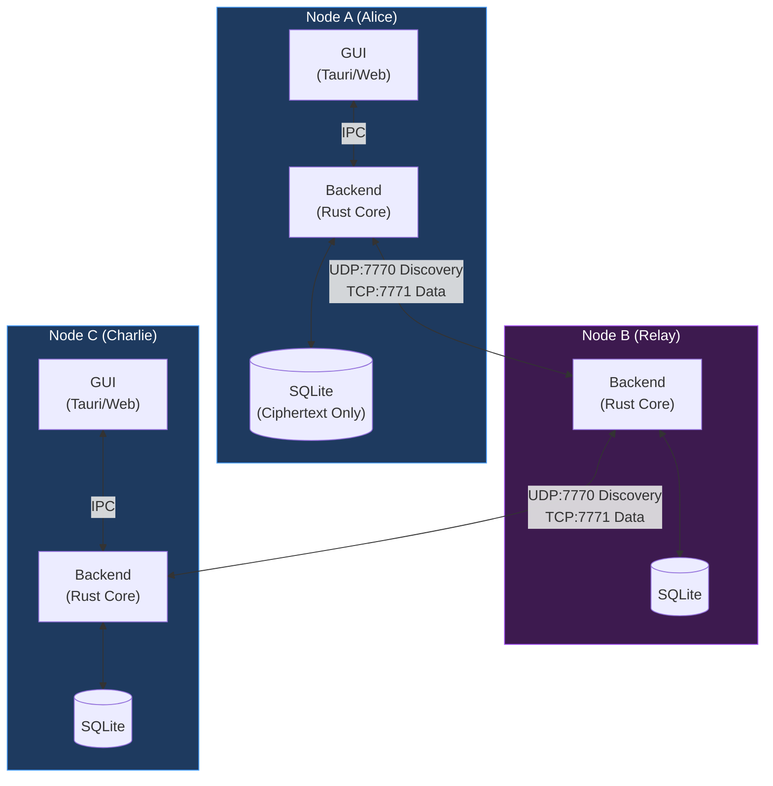
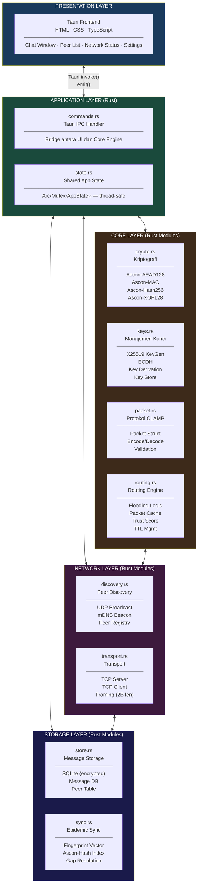
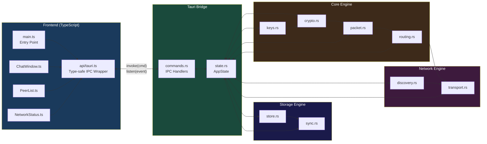
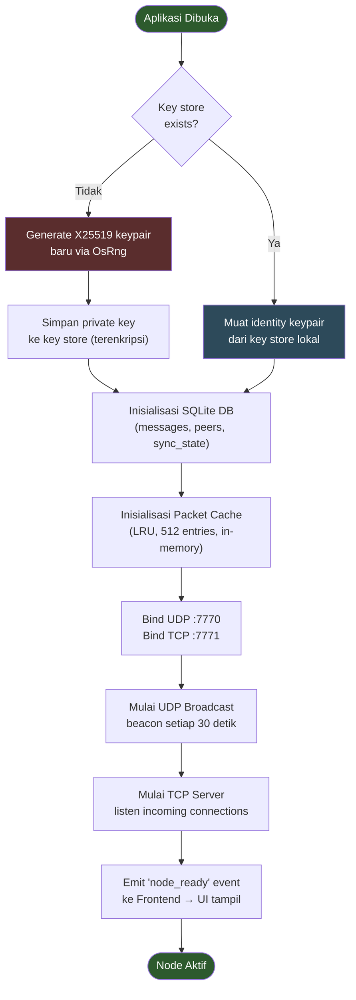
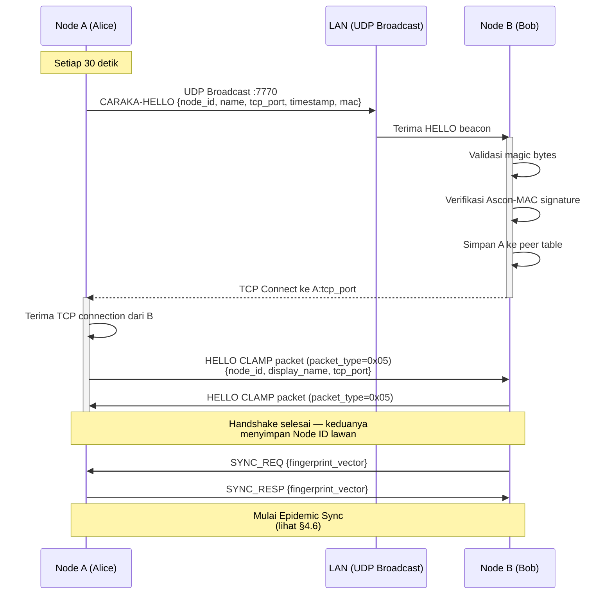
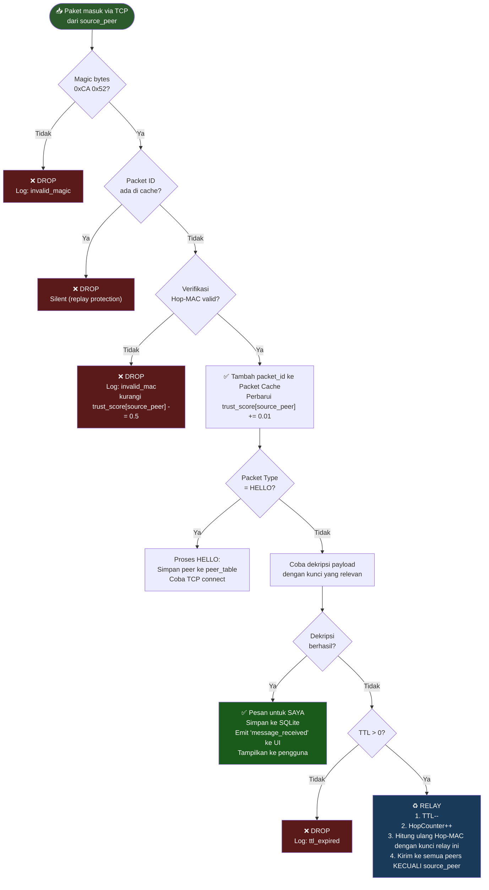
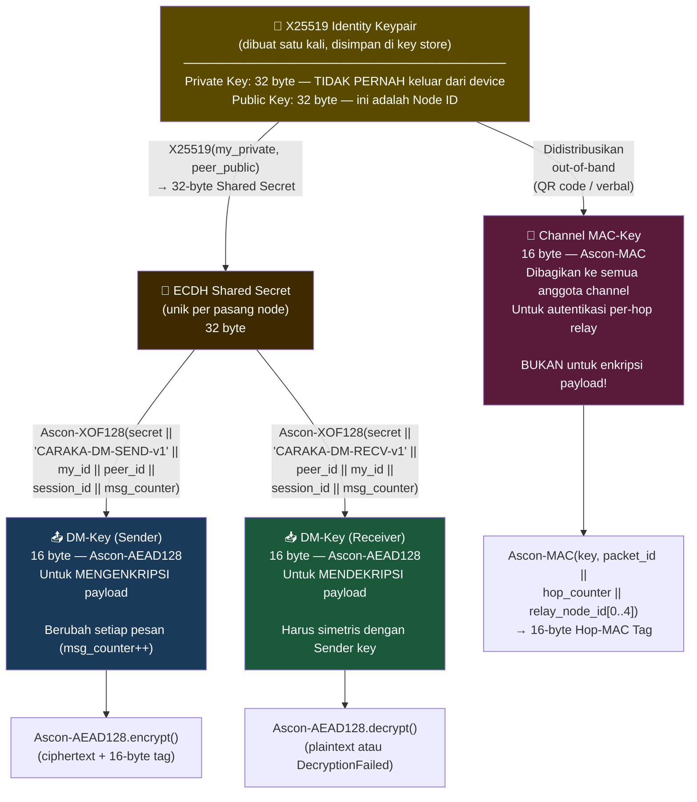
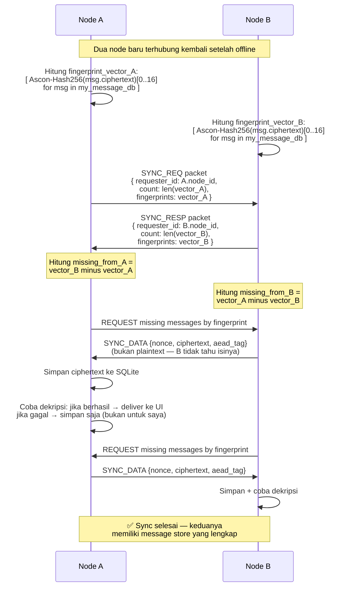
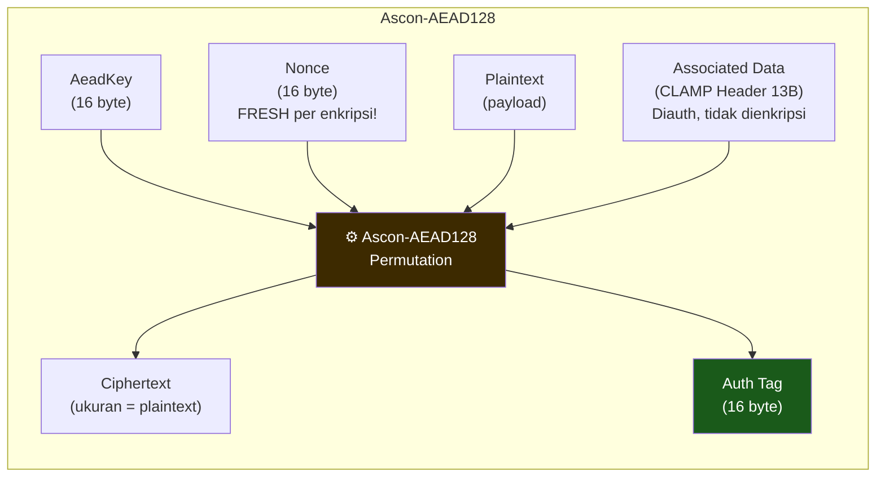

# Technical Architecture Document
## CARAKA Desktop — *Cryptographically Authenticated Relay Architecture for Knowledge and Autonomy*

**Versi:** 0.1
**Tanggal:** Juni 2026
**Status:** Draft

---

## Daftar Isi

1. [Gambaran Sistem (System Overview)](#1-gambaran-sistem-system-overview)
2. [Arsitektur Berlapis (Layered Architecture)](#2-arsitektur-berlapis-layered-architecture)
3. [Diagram Komponen (Component Diagram)](#3-diagram-komponen-component-diagram)
4. [Alur Fungsi Utama (Function Flow Diagrams)](#4-alur-fungsi-utama-function-flow-diagrams)
   - 4.1 [Inisialisasi Node](#41-inisialisasi-node)
   - 4.2 [Peer Discovery](#42-peer-discovery)
   - 4.3 [Pengiriman Pesan (Send DM)](#43-pengiriman-pesan-send-dm)
   - 4.4 [Penerimaan dan Relay Paket](#44-penerimaan-dan-relay-paket)
   - 4.5 [Derivasi Kunci (Key Derivation)](#45-derivasi-kunci-key-derivation)
   - 4.6 [Epidemic Sync (Offline Reconnect)](#46-epidemic-sync-offline-reconnect)
5. [Arsitektur Modul (Module Architecture)](#5-arsitektur-modul-module-architecture)
6. [Arsitektur Kriptografi](#6-arsitektur-kriptografi)
7. [Spesifikasi Protokol CLAMP](#7-spesifikasi-protokol-clamp)
8. [Skema Database](#8-skema-database)
9. [Tauri IPC Reference](#9-tauri-ipc-reference)
10. [Properti Keamanan](#10-properti-keamanan)
11. [Dependensi](#11-dependensi)

---

## 1. Gambaran Sistem (System Overview)

CARAKA Desktop adalah aplikasi komunikasi desktop berbasis jaringan *Peer-to-Peer Mesh* yang beroperasi tanpa internet maupun server pusat. Setiap node bertindak sekaligus sebagai pengirim, penerima, dan relay pesan.



**Prinsip Desain Utama:**

| Prinsip | Penjelasan |
|---|---|
| **Offline-First** | Tidak memerlukan internet atau server. LAN/Wi-Fi sudah cukup. |
| **Zero-Trust Relay** | Node relay *tidak dapat* membaca isi pesan yang diteruskan |
| **LWC-Native** | Seluruh kriptografi simetris menggunakan keluarga Ascon (NIST SP 800-232) |
| **No Central Authority** | Identitas adalah keypair X25519 yang dibuat lokal; tidak ada CA |
| **Store-and-Forward** | Pesan disimpan sementara jika penerima offline |

---

## 2. Arsitektur Berlapis (Layered Architecture)



---

## 3. Diagram Komponen (Component Diagram)



---

## 4. Alur Fungsi Utama (Function Flow Diagrams)

### 4.1 Inisialisasi Node

Diagram ini menunjukkan apa yang terjadi ketika CARAKA Desktop pertama kali dijalankan.



---

### 4.2 Peer Discovery

Diagram ini menunjukkan bagaimana dua node saling menemukan dalam jaringan LAN.



---

### 4.3 Pengiriman Pesan (Send DM)

Diagram ini menunjukkan seluruh pipeline dari pengguna mengetik pesan hingga paket terkirim ke jaringan.

```mermaid
flowchart TD
    subgraph UI["FRONTEND"]
        U1["User ketik pesan\n→ Klik Send"]
        U2["invoke('send_dm', {recipient_id, plaintext})"]
    end

    subgraph IPC["TAURI IPC"]
        T1["commands.rs\nsend_dm handler dipanggil"]
    end

    subgraph KEYGEN["MANAJEMEN KUNCI (keys.rs)"]
        K1["Ambil alice_private_key\ndari key store"]
        K2["Ambil charlie_public_key\ndari peer table"]
        K3["ECDH:\nshared_secret = X25519(alice_private, charlie_public)"]
        K4["Buat session context:\nsession_id (jika baru)\nmsg_counter (increment)"]
        K5["Derive aead_key =\nAscon-XOF128(shared_secret ||\n'CARAKA-DM-SEND-v1' ||\nalice_id || charlie_id ||\nsession_id || msg_counter)"]
    end

    subgraph ENC["ENKRIPSI (crypto.rs)"]
        E1["Generate nonce (16B):\ntimestamp_u32[0..4] || OsRng[4..16]"]
        E2["Associated data = clamp_header_bytes"]
        E3["(ciphertext, tag) =\nAscon-AEAD128.encrypt(\nkey=aead_key, nonce=nonce,\nplaintext=message,\nad=associated_data)"]
    end

    subgraph PKT["BANGUN PAKET (packet.rs)"]
        P1["Bangun ClampHeader:\nmagic=0xCA52, version=1\ntype=DM, TTL=7\npacket_id=alice_id[0..4]||rand[4..8]"]
        P2["Hitung Hop-MAC:\nhop_mac = Ascon-MAC(\nkey=channel_key,\ndata=packet_id||hop_counter=0||alice_id[0..4])"]
        P3["Paket lengkap:\nHeader(13B) + HopAuth(17B) +\nNonce(16B) + Ciphertext + Tag(16B)"]
    end

    subgraph SEND["SIMPAN + KIRIM (store.rs + routing.rs)"]
        S1["Simpan ciphertext ke SQLite\n(packet_id, ciphertext, nonce, tag)"]
        S2["Tambah packet_id ke Packet Cache\n(LRU-512 — untuk replay protection)"]
        S3["Kirim ke semua connected peers\nvia TCP (transport.rs)"]
    end

    U1 --> U2 --> T1
    T1 --> K1 --> K2 --> K3 --> K4 --> K5
    K5 --> E1 --> E2 --> E3
    E3 --> P1 --> P2 --> P3
    P3 --> S1 --> S2 --> S3

    style UI fill:#1a3a5c,color:#fff
    style IPC fill:#1a4a3c,color:#fff
    style KEYGEN fill:#3d2a1a,color:#fff
    style ENC fill:#3d1a1a,color:#fff
    style PKT fill:#2a1a3d,color:#fff
    style SEND fill:#1a3d3d,color:#fff
```



---

### 4.4 Penerimaan dan Relay Paket

Diagram ini menunjukkan decision tree yang terjadi setiap kali sebuah node menerima paket CLAMP dari jaringan.



---

### 4.5 Derivasi Kunci (Key Derivation)

Diagram ini menunjukkan hierarki derivasi seluruh kunci kriptografi dari keypair identitas.



---

### 4.6 Epidemic Sync (Offline Reconnect)

Diagram ini menunjukkan bagaimana dua node menyinkronkan pesan yang terlewat setelah periode offline.



---

## 5. Arsitektur Modul (Module Architecture)

### 5.1 `crypto.rs` — Kriptografi

```rust
// Tipe kunci utama
pub struct AeadKey(pub [u8; 16]);      // Ascon-AEAD128 key
pub struct MacKey(pub [u8; 16]);       // Ascon-MAC key
pub struct Nonce(pub [u8; 16]);        // AEAD nonce (timestamp + random)
pub struct AeadTag(pub [u8; 16]);      // Authentication tag
pub struct MacTag(pub [u8; 16]);       // Hop-MAC tag

// API publik
pub fn encrypt(key: &AeadKey, nonce: &Nonce, plaintext: &[u8], aad: &[u8])
    -> Result<(Vec<u8>, AeadTag), CryptoError>;

pub fn decrypt(key: &AeadKey, nonce: &Nonce, ciphertext: &[u8],
               tag: &AeadTag, aad: &[u8]) -> Result<Vec<u8>, CryptoError>;

pub fn compute_mac(key: &MacKey, data: &[u8]) -> MacTag;
pub fn verify_mac(key: &MacKey, data: &[u8], tag: &MacTag) -> bool;

pub fn hash256(data: &[u8]) -> [u8; 32];        // Ascon-Hash256
pub fn xof_derive(key: &[u8], context: &[u8], out: &mut [u8]);  // Ascon-XOF128

pub fn generate_nonce() -> Nonce;  // timestamp_u32 || OsRng[12B]
```

### 5.2 `keys.rs` — Manajemen Kunci

```rust
pub struct NodePrivateKey([u8; 32]);   // implements Zeroize
pub struct NodePublicKey(pub [u8; 32]); // = Node ID

// API publik
pub fn generate_identity_keypair() -> (NodePrivateKey, NodePublicKey);
pub fn ecdh(my_private: &NodePrivateKey, peer_public: &NodePublicKey) -> [u8; 32];
pub fn derive_dm_key(shared: &[u8; 32], session_id: &[u8; 8],
                     msg_counter: u64, is_sender: bool) -> AeadKey;
pub fn node_fingerprint(public_key: &NodePublicKey) -> String; // hex[0..8]

// Key store persistence
pub fn save_identity(key: &NodePrivateKey) -> Result<()>;
pub fn load_identity() -> Result<NodePrivateKey>;
```

### 5.3 `packet.rs` — Protokol CLAMP

```rust
#[repr(u8)]
pub enum PacketType { DM = 0x01, Channel = 0x02, Hello = 0x05,
                      SyncReq = 0x03, SyncResp = 0x04, SyncData = 0x06 }

pub struct ClampHeader {    // 13 byte total, plaintext
    pub magic: [u8; 2],     // 0xCA, 0x52
    pub version: u8,         // 0x01
    pub packet_type: u8,     // PacketType
    pub ttl: u8,             // max 7
    pub packet_id: [u8; 8], // origin_id[0..4] || rand[4..8]
}

pub struct HopAuth {        // 17 byte total
    pub hop_counter: u8,
    pub mac_tag: [u8; 16],
}

pub struct ClampPacket {
    pub header: ClampHeader,
    pub hop_auth: HopAuth,
    pub nonce: [u8; 16],
    pub ciphertext: Vec<u8>,
    pub aead_tag: [u8; 16],
}

// API publik
pub fn encode(packet: &ClampPacket) -> Vec<u8>;
pub fn decode(bytes: &[u8]) -> Result<ClampPacket, PacketError>;
pub fn validate_timestamp(nonce: &[u8; 16]) -> bool; // ±300 detik
```

### 5.4 `routing.rs` — Routing Engine

```rust
pub struct Router {
    packet_cache: LruCache<[u8; 8], ()>,        // 512 entries
    trust_scores: HashMap<NodePublicKey, f32>,   // [0.0, 5.0]
    connected_peers: HashMap<NodePublicKey, Arc<TcpStream>>,
    my_node_id: NodePublicKey,
    channel_mac_key: MacKey,
}

impl Router {
    pub async fn handle_incoming(&mut self, raw: &[u8], source: &NodePublicKey)
        -> Result<RoutingDecision, RouterError>;

    pub async fn broadcast(&self, packet: &ClampPacket,
                           exclude: Option<&NodePublicKey>);

    fn verify_hop_mac(&self, packet: &ClampPacket, source: &NodePublicKey) -> bool;
    fn recompute_hop_mac(&self, packet: &mut ClampPacket);
    fn update_trust(&mut self, peer: &NodePublicKey, delta: f32);
}

pub enum RoutingDecision { DeliverToApp(Vec<u8>), Relay, Drop(DropReason) }
```

### 5.5 `discovery.rs` — Peer Discovery

```rust
// UDP HELLO beacon (55 byte):
// magic(4) + node_id(32) + display_name(64) + tcp_port(2) + timestamp(8) + mac(16)

pub async fn start_broadcaster(node_id: NodePublicKey, tcp_port: u16,
                               display_name: &str, interval_sec: u64);

pub async fn start_listener(tx: mpsc::Sender<DiscoveredPeer>);

pub struct DiscoveredPeer {
    pub node_id: NodePublicKey,
    pub display_name: String,
    pub ip: IpAddr,
    pub tcp_port: u16,
    pub last_seen: u64,
}
```

### 5.6 `store.rs` — Storage Engine

```rust
// Hanya menyimpan ciphertext — tidak pernah plaintext
pub struct StoredMessage {
    pub id: String,           // Hex(Ascon-Hash256(ciphertext))
    pub packet_id: String,    // CLAMP Packet ID (hex)
    pub sender_id: String,    // Node ID pengirim (hex)
    pub recipient_id: String, // Node ID penerima (hex)
    pub nonce: Vec<u8>,
    pub ciphertext: Vec<u8>,
    pub aead_tag: Vec<u8>,
    pub received_at: i64,
    pub delivered: bool,
}

pub fn save_message(conn: &Connection, msg: &StoredMessage) -> Result<()>;
pub fn get_messages(conn: &Connection, peer_id: &str, limit: i64)
    -> Result<Vec<StoredMessage>>;
pub fn get_all_fingerprints(conn: &Connection) -> Result<Vec<[u8; 16]>>;
pub fn get_ciphertext_by_fingerprint(conn: &Connection, fp: &[u8; 16])
    -> Result<Option<StoredMessage>>;
```

---

## 6. Arsitektur Kriptografi

### 6.1 Stack Kriptografi CARAKA

| Fungsi | Primitif | Ukuran | Standar |
|---|---|---|---|
| Enkripsi Payload (E2EE) | Ascon-AEAD128 | Key: 128-bit, Tag: 128-bit | NIST SP 800-232 |
| Fungsi Hash | Ascon-Hash256 | Output: 256-bit | NIST SP 800-232 |
| Derivasi Kunci | Ascon-XOF128 | Output: variabel | NIST SP 800-232 |
| Autentikasi per-Hop | Ascon-MAC | Key: 128-bit, Tag: 128-bit | Berbasis Ascon permutation |
| Key Exchange | X25519 (ECDH) | 255-bit | RFC 7748 |

### 6.2 Properti Keamanan AEAD



**Catatan kritis:**
- Nonce **WAJIB** fresh (unik) untuk setiap enkripsi dengan kunci yang sama
- Associated Data (header CLAMP) di-*bind* ke ciphertext → header tidak bisa dimanipulasi
- Modifikasi ciphertext → Tag tidak match → `DecryptionFailed`

---

## 7. Spesifikasi Protokol CLAMP

### 7.1 Struktur Paket (Byte-Level)

```
Offset  Size  Field           Deskripsi
──────  ────  ─────────────  ──────────────────────────────────────────
0       2     magic           0xCA, 0x52 — identifikasi protokol
2       1     version         0x01 — versi protokol saat ini
3       1     packet_type     0x01=DM | 0x02=Channel | 0x03=SyncReq
                              0x04=SyncResp | 0x05=Hello | 0x06=SyncData
4       1     ttl             Sisa hop yang diizinkan, max awal = 7
5       8     packet_id       origin_node_id[0..4] || OsRng[4..8]
─────────────────────────────────────────────────────────────────────
13      1     hop_counter     Jumlah hop yang telah dilalui, awal = 0
14      16    hop_mac_tag     Ascon-MAC(ch_key, pkt_id||hop_ctr||relay_id[0..4])
─────────────────────────────────────────────────────────────────────
30      16    nonce           timestamp_u32_LE[0..4] || OsRng[4..16]
46      N     ciphertext      Ascon-AEAD128 encrypted payload
46+N    16    aead_tag        Ascon-AEAD128 authentication tag

Total fixed overhead: 62 byte
```

### 7.2 Hop-MAC Computation

```
mac_input = concat(
    packet_id    [8 byte]   — unik per pesan original
    hop_counter  [1 byte]   — meningkat di setiap relay
    relay_id[0..4] [4 byte] — prefix node ID relay saat ini
)
// Total: 13 byte input

hop_mac = Ascon-MAC(key=channel_mac_key, data=mac_input)
// Output: 16 byte tag
```

**Perbandingan overhead vs Ed25519:**

| Metode | Ukuran | Keamanan | Komputasi |
|---|---|---|---|
| Ed25519 signature (existing) | 64 byte | 128-bit (asimetris) | Lambat (ECC ops) |
| **Ascon-MAC (CARAKA)** | **17 byte** (1+16) | **128-bit (simetris)** | **Cepat (sponge)** |
| **Penghematan** | **-47 byte (73%)** | Ekuivalen | Lebih cepat |

### 7.3 Constants

| Konstanta | Nilai | Keterangan |
|---|---|---|
| `MAGIC` | `[0xCA, 0x52]` | Identifikasi protokol |
| `PROTOCOL_VERSION` | `0x01` | Versi saat ini |
| `TTL_MAX` | `7` | Maksimum hop awal |
| `DISCOVERY_PORT` | `7770` | UDP broadcast port |
| `DATA_PORT` | `7771` | TCP data port (default) |
| `PACKET_CACHE_SIZE` | `512` | Entri LRU untuk dedup replay |
| `TIMESTAMP_WINDOW_SEC` | `300` | Jendela validitas nonce (±5 menit) |
| `DISCOVERY_INTERVAL_SEC` | `30` | Interval UDP beacon |
| `MAX_RELAY_RATE` | `50` | Maks paket/detik per peer (flood control) |

---

## 8. Skema Database

```sql
-- ============================================================
-- TABEL: messages
-- Catatan: TIDAK PERNAH menyimpan plaintext
-- ============================================================
CREATE TABLE messages (
    id           TEXT PRIMARY KEY,   -- Hex(Ascon-Hash256(ciphertext))
    packet_id    TEXT NOT NULL UNIQUE,
    sender_id    TEXT NOT NULL,      -- Node ID pengirim (hex 64 char)
    recipient_id TEXT NOT NULL,      -- Node ID penerima atau "channel:{id}"
    nonce        BLOB NOT NULL,      -- 16 byte AEAD nonce
    ciphertext   BLOB NOT NULL,      -- Raw ciphertext
    aead_tag     BLOB NOT NULL,      -- 16 byte AEAD tag
    received_at  INTEGER NOT NULL,   -- Unix timestamp (detik)
    delivered    INTEGER DEFAULT 0   -- 0=pending, 1=delivered ke UI
);
CREATE INDEX idx_messages_sender ON messages(sender_id);
CREATE INDEX idx_messages_recipient ON messages(recipient_id);
CREATE INDEX idx_messages_time ON messages(received_at);

-- ============================================================
-- TABEL: peers
-- ============================================================
CREATE TABLE peers (
    node_id      TEXT PRIMARY KEY,   -- X25519 Public Key (hex, 64 char)
    display_name TEXT,
    last_seen    INTEGER,
    ip_address   TEXT,
    tcp_port     INTEGER,
    trust_score  REAL DEFAULT 1.0,   -- [0.0, 5.0]
    verified     INTEGER DEFAULT 0   -- 1 = fingerprint diverifikasi manual
);

-- ============================================================
-- TABEL: local_keys
-- Kunci dienkripsi di application level sebelum disimpan
-- ============================================================
CREATE TABLE local_keys (
    key_id       TEXT PRIMARY KEY,   -- "identity" | "channel:{id}"
    key_type     TEXT NOT NULL,      -- "x25519_private" | "ascon_mac"
    key_material BLOB NOT NULL,      -- Kunci terenkripsi
    created_at   INTEGER NOT NULL
);

-- ============================================================
-- TABEL: sync_state
-- Tracking Epidemic Sync per peer
-- ============================================================
CREATE TABLE sync_state (
    peer_id    TEXT NOT NULL,
    message_id TEXT NOT NULL,        -- = messages.id
    synced     INTEGER DEFAULT 0,
    PRIMARY KEY (peer_id, message_id)
);
```

---

## 9. Tauri IPC Reference

### 9.1 Commands (Frontend → Backend)

```typescript
// Panggil dari TypeScript dengan: invoke('command_name', params)

invoke('init_node', { displayName: string })
    → Promise<{ nodeId: string, displayName: string, fingerprint: string }>

invoke('send_dm', { recipientId: string, plaintext: string })
    → Promise<string>  // message ID

invoke('get_messages', { peerId: string, limit: number })
    → Promise<Array<{ senderId: string, plaintext: string, timestamp: number }>>

invoke('get_peers', {})
    → Promise<Array<{ nodeId: string, displayName: string, ip: string,
                      trustScore: number, verified: boolean, online: boolean }>>

invoke('add_peer_manual', { ip: string, port: number })
    → Promise<{ nodeId: string, displayName: string }>

invoke('get_network_status', {})
    → Promise<{ peersOnline: number, messagesRelayed: number, myNodeId: string }>
```

### 9.2 Events (Backend → Frontend)

```typescript
// Dengarkan dari TypeScript dengan: listen('event_name', handler)

listen('message_received', (event: {
    payload: { senderId: string, plaintext: string, timestamp: number }
}) => { ... })

listen('peer_discovered', (event: {
    payload: { nodeId: string, displayName: string, ip: string }
}) => { ... })

listen('peer_disconnected', (event: {
    payload: { nodeId: string }
}) => { ... })

listen('sync_complete', (event: {
    payload: { peerId: string, syncedCount: number }
}) => { ... })

listen('node_ready', (event: {
    payload: { nodeId: string, fingerprint: string }
}) => { ... })
```

---

## 10. Properti Keamanan

| Properti | Mekanisme | Status |
|---|---|---|
| **Confidentiality** | Ascon-AEAD128 E2EE — hanya penerima yang punya kunci | ✅ |
| **Integrity** | AEAD tag 128-bit — modifikasi apapun = gagal dekripsi | ✅ |
| **Relay Integrity** | Hop-MAC 128-bit — relay tidak sah = packet drop | ✅ |
| **Replay Protection** | LRU Packet ID cache (512) + timestamp window ±5 menit | ✅ |
| **Node Authentication** | X25519 public key sebagai identitas; ECDH membuktikan kepemilikan private key | ✅ |
| **Metadata Protection** | Payload E2EE; header hanya berisi Packet ID + TTL (bukan sender/receiver) | ✅ Parsial |
| **Forward Secrecy** | Session-scoped key derivation (session_id + msg_counter) | ✅ Parsial |
| **Post-Quantum** | X25519 tidak post-quantum | ❌ Roadmap v0.3 |
| **Full Anonymity** | IP address peer masih terlihat; onion routing belum ada | ❌ Roadmap v0.2 |

---

## 11. Dependensi

```toml
[dependencies]
# === KRIPTOGRAFI ===
ascon-aead    = { version = "0.4", features = ["ascon128"] }
ascon         = "0.4"
x25519-dalek  = { version = "2", features = ["static_secrets"] }
hkdf          = "0.12"
sha2          = "0.10"
rand          = { version = "0.8", features = ["std"] }
zeroize       = { version = "1", features = ["derive"] }

# === JARINGAN ===
tokio         = { version = "1", features = ["full"] }

# === STORAGE ===
rusqlite      = { version = "0.31", features = ["bundled"] }
serde         = { version = "1", features = ["derive"] }
serde_json    = "1"
bincode       = "1"

# === UTILITIES ===
lru           = "0.12"
thiserror     = "1"
tracing       = "0.1"
tracing-subscriber = "0.3"

# === TAURI ===
tauri         = { version = "2", features = [] }
tauri-build   = { version = "2", build = true }

[dev-dependencies]
criterion     = { version = "0.5", features = ["html_reports"] }

[[bench]]
name    = "crypto_bench"
harness = false
```

---

*— Akhir Technical Architecture Document CARAKA Desktop v0.1 —*
